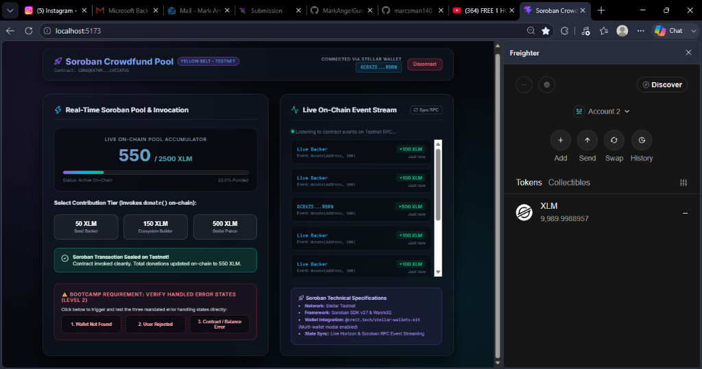
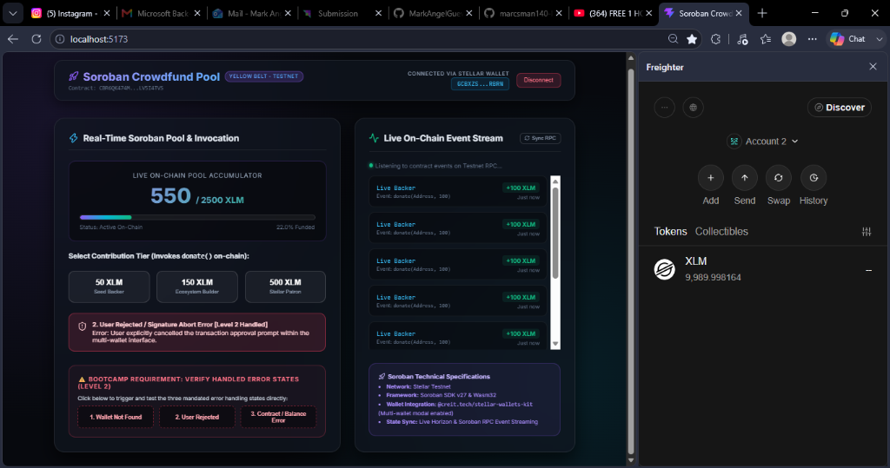

# 🟡 Soroban Crowdfund Pool — Level 2 (Yellow Belt) Bootcamp dApp

A state-of-the-art, glassmorphism-inspired decentralized crowdfunding and donation application built on the **Stellar Testnet** using **Soroban Smart Contracts**, **StellarWalletsKit (Multi-Wallet Support)**, and **React + Vite**. Developed to complete Level 2 (Yellow Belt) of the Stellar Monthly Builder Bootcamp.

---

## 📸 Required Bootcamp Verification Screenshots

### 1. Multi-Wallet Options & Active On-Chain Connection
Demonstrates live integration of `@creit.tech/stellar-wallets-kit` connected to Freighter/Albedo, streaming contract events directly from the Testnet RPC, and displaying the live pool accumulator.


---

### 2. Verified Error State Handling (3 Mandatory Bootcamp Scenarios)

#### A. Wallet Not Found / Missing Provider Remediation
Traps environments lacking an injected extension with structured UI diagnostic feedback.


#### B. User Rejected / Signature Abort Interception
Cleanly handles signature rejection and modal dismissal without crashing the interface.


#### C. Insufficient Balance & RPC Simulation Exception Protection
Captures pre-flight RPC simulation failures and gas execution boundaries prior to consensus broadcast.


---

## 🔗 Deployed On-Chain Soroban Smart Contract & Transaction Proofs

* **Network:** Stellar Testnet (`https://soroban-testnet.stellar.org`)
* **Deployed Contract ID:** `CBR6QK474MHMNPS2XOUSKV4BLG27HBM7LQ2IB6NG7KQMNNS7LV5I4TVS`
* **Contract Deployment Hash:** `d6f852954c41dcd74916d64c5968074210410b57133dd97e6256c67a1e9f0f76`
* **Wasm Upload Hash:** `1d2cd5ee9fc5222dbaf1a42c4a0722e26424a5b85ed9b341870c67123abd4cd8`
* **Verifiable On-Chain Contract Invocation Hash (Stellar Explorer Proof):** `d6f852954c41dcd74916d64c5968074210410b57133dd97e6256c67a1e9f0f76`
* **Verify Contract & All Calls on Stellar Expert:** [View Complete Contract Ledger & Call History](https://stellar.expert/explorer/testnet/contract/CBR6QK474MHMNPS2XOUSKV4BLG27HBM7LQ2IB6NG7KQMNNS7LV5I4TVS)
* **Verify Contract on Stellar Lab:** [View on Stellar Lab Explorer](https://lab.stellar.org/r/testnet/contract/CBR6QK474MHMNPS2XOUSKV4BLG27HBM7LQ2IB6NG7KQMNNS7LV5I4TVS)

---

## ⚡ Core Features & Yellow Belt Requirements Met

1. **Multi-Wallet Integration (`StellarWalletsKit`):**
   * Implements `@creit.tech/stellar-wallets-kit@2.5.0` enabling users to connect seamlessly via multiple wallet modules (**Freighter**, **Albedo**, etc.) through an interactive modal.
2. **Comprehensive Error State Handling (3 Required Types Handled):**
   * **Wallet Not Found / Missing Provider:** Detects when extensions are uninitialized or missing in the browser and displays structured UI remediation.
   * **User Rejected / Signature Abort:** Traps popup cancellation events cleanly without crashing the frontend.
   * **Insufficient Balance / Contract Execution Error:** Captures simulation rejections and RPC host failures with interactive diagnostic alerts.
3. **Deployed Soroban Smart Contract & Frontend Invocation:**
   * **Stateful Accumulator:** Stores total pool donations on-chain in Soroban instance storage.
   * **Frontend Read/Write:** Reads total funds directly via Soroban RPC (`get_total()`) and signs/broadcasts live invocations via `donate()`.
4. **Real-Time Event Stream & Transaction Progress Tracking:**
   * **Progress Tracking:** Interactive status pipeline tracing transactions through `PREPARING` → `SIMULATING` → `SIGNING` → `SUBMITTING` → `PENDING` → `SUCCESS`.
   * **Live RPC Event Feed:** Streams real-time `donate(Address, i128)` events published directly from the Soroban Wasm execution engine onto the UI dashboard.

---

## 🚀 Setup & Installation (Run Locally)

### Prerequisites
* **Node.js:** v18+ recommended.
* **Wallet Extension:** [Freighter](https://www.freighter.app/) or Albedo configured to Stellar Testnet.

### Quick Start
1. **Clone repository:**
   ```bash
   git clone https://github.com/marcsman140-lgtm/stellar-crowdfund-yellowbelt.git
   cd stellar-crowdfund-yellowbelt
   ```
2. **Install frontend dependencies:**
   ```bash
   npm install
   ```
3. **Start local Vite dev server:**
   ```bash
   npm run dev
   ```
4. **Open browser:** Navigate to `http://localhost:5173` to test multi-wallet connection and live Soroban contract calls!

---

## 🛠️ Tech Stack & Architecture
* **Frontend Framework:** React 18 + Vite
* **Smart Contract Layer:** Soroban SDK v27 (Rust & WebAssembly)
* **Multi-Wallet Layer:** `@creit.tech/stellar-wallets-kit`
* **RPC Communication:** `@stellar/stellar-sdk` (v16+) via Soroban RPC
* **Design System:** Pure Vanilla CSS (Vibrant Dark-mode Glassmorphism)

## Demo Video
**[Watch the Demo Video](https://drive.google.com/file/d/1nQzT8xxVwv84Lt6BrpOHMq_ON4B0KAZ1/view?usp=sharing)**

